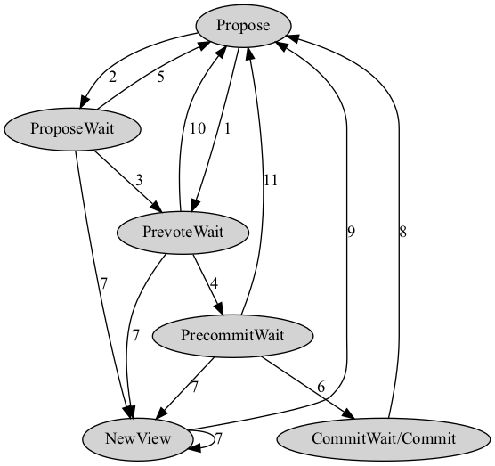
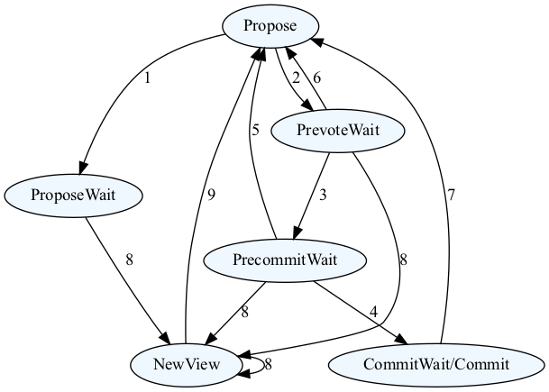
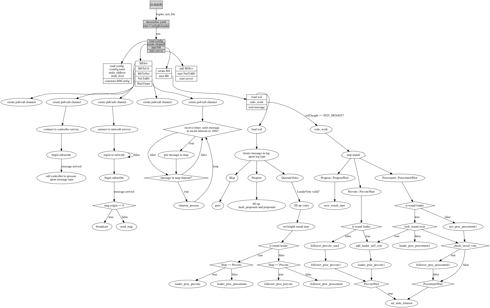

# consensus_bft
类似Tendermint的共识协议，取消`commit`阶段并使用`leader`归票降低网络通信复杂度

## 编译docker镜像
```
docker build -t citacloud/consensus_bft .   
```

## 使用方法

```
$ consensus -h       
consensus 6.4.0
Rivtower Technologies <contact@rivtower.com>
This doc string acts as a help message when the user runs '--help' as do all doc strings on fields

USAGE:
    consensus <SUBCOMMAND>

OPTIONS:
    -h, --help       Print help information
    -V, --version    Print version information

SUBCOMMANDS:
    help    Print this message or the help of the given subcommand(s)
    run     run this service
```

### consensus-run

运行`consensus`服务。

```
$ consensus run -h
consensus-run 
run this service

USAGE:
    consensus run [OPTIONS]

OPTIONS:
    -c, --config <CONFIG_PATH>    Chain config path [default: config.toml]
    -h, --help                    Print help information
    -l, --log <LOG_FILE>          log config path [default: consensus-log4rs.yaml]

```

参数：
1. 微服务配置文件。

   参见示例`example/config.toml`。

   其中：
    * `consensus_port` 为该服务监听的端口号。
2. 日志配置文件。

   参见示例`consensus-log4rs.yaml`。

   其中：

    * `level` 为日志等级。可选项有：`Error`，`Warn`，`Info`，`Debug`，`Trace`，默认为`Info`。
    * `appenders` 为输出选项，类型为一个数组。可选项有：标准输出(`stdout`)和滚动的日志文件（`journey-service`），默认为同时输出到两个地方。

```
$ consensus run -c example/config.toml -l consensus-log4rs.yaml
2022-03-10T10:04:09.850581+08:00 INFO consensus - start consensus bft
2022-03-10T10:04:09.851129+08:00 INFO consensus - grpc port of this service: 50001
```


## 状态转换
### Leader


1. Leader send new proposal success
2. Leader send new proposal fail
3. Leader retry send new proposal success
4. When leader receive the Prevote vote from follower,if it has send the proposal, and collect above 2/3 Prevote votes then change to PrecommitWait
5. ProposeWait timeout and leader has collect above 2/3 Prevote votes, then
- send Prevote vote with None hash
- start new round
6. When leader receive the Precommit vote, and it has collect above 2/3 Precommit votes.
   If current leader isn't the (next height, init round) leader then change to CommitWait temporary and soon change to Commit else change to Commit
7. Leader send message timeout and hasn't collect above 2/3 votes, change to NewView
8. In the case below, change to Proposal
- CommitWait timeout and deal old height success
- Commit timeout and check and commit block failed, then start new round
9. Leader has collect 2f NewView votes, start new round
10. When leader receive Prevote, in the case below change to Proposal
- has collect 2f Prevote and self.round behind round, start new round
- hash in the voteset which is above 2/3 n is zero, start new round
- hasn't receive the Proposal yet which the hash is above 2/3 n, start new round
11. When leader receive Precommit, in the case below change to Proposal
- hash in the voteset which is above 2/3 n is zero, start new round
- self.proposal not equal the hash in the voteset which is above 2/3 n, start new round
- else if check and commit block failed, then start new round

### Follower

1. Follower hasn't receive the Proposal
2. Follower has receive the Proposal and add to proposals, hash_proposals , set proposal and send Prevote
3. When receive the LeaderPrevote , check it, save to wal and send Precommit
4. In the case below, change to CommitWait/Commit
- When receive the LeaderPrevote and change to PrecommitWait success, and if has receive LeaderPrecommit with above 2/3 Precommit from leader, then enter the follow case
- When follower receive the LeaderPrecommit with above 2/3 Precommit votes and save to wal, If current leader isn't the (next height, init round) leader then change to CommitWait temporary and soon change to Commit else change to Commit
5. Follower receive Precommit whose hash is zero or check and commit block failed, start new round, change to Proposal
6. Follower receive Prevote whose hash is zero, or hasn't receive the proposal , then start new round, change to Proposal
7. In the case below, change to Proposal
- CommitWait timeout and deal old height success
- Commit timeout and check and commit block failed, then start new round
8. Follower send message timeout and send NewView message, then change to NewView
9. Follower has collect 2f NewView votes, start new round

## 启动及运行流程


- **启动**
    - 加载配置
    - 创建`controller<->bft`, `network<->bft`, `timeout->bft`的通道`channel`，并将通道`channel`句柄放入`bft_channels`
    - 初始化`bft`并开始`select loop`
    - 启动`server`，添加`uri`匹配规则，监听指定端口，并将匹配的`uri`转发至相应的通道`channel`

- **运行**
    - `controller->bft`的`reconfigure`及`check_block`请求，做出相应处理，并返回处理结果
        - `reconfigure`
            - 更新`auth_manage`及`is_consensus_node`
            - 如果当前节点是`(next height, init round)`的`leader`，则请求`controller` `GetProposal`，根据结果值设置`proposal` `self_proposal` `proposals`及相关值，并发送`new proposal`
        - `check_block`
            - 检查收到的`LeaderVote`中的`vote`是否正确
    - `network->bft`的消息会根据其`VoteMsgtype`进行相应处理，并根据发送消息至其他节点
        - `Proposal`
            - 只有`follower`会收到该消息，在校验`(height, round, step)`通过，请求`controller` `CheckProposal`，将其加入`votes`
            - 上一步检查通过后，设置proposal self_proposal proposals，发送自己的Prevote消息，变更状态，设置超时时间
        - `Prevote`
            - `leader`收到消息校验`(height, round, step)`及消息的发送节点的正确性后，将其加入`votes`
            - 上一步检查通过后，检查`Prevote`数量进行相应处理，详见状态转换
        - `Precommit`
            - `leader`收到消息校验`(height, round, step)`及消息的发送节点的正确性后，将其加入`votes`
            - 上一步检查通过后，检查`Precommit`数量进行相应处理，详见状态转换
        - `LeaderPrevote`
            - follower收到消息校验`(height, round, step)`，消息的发送节点的正确性，及其票数是否超过`2/3`后，将其加入`votes`，并保存至`wal`
            - 上一步检查通过后，做进一步处理，详见状态转换
        - `LeaderPrecommit`
            - `follower`收到消息校验`(height, round, step)`，消息的发送节点的正确性，及其票数是否超过`2/3`后，将其加入`votes`，并保存至`wal`
            - 上一步检查通过后，做进一步处理，详见状态转换
        - `NewView`
            - 收到消息校验`(height, round, step)`，消息的发送节点的正确性后，将其加入`votes`
            - 上一步检查通过后，若当前节点收到`2f`个`NewView`，发送`NewView`消息，开始新的`round`
    - `timeout->bft`根据超时的消息类型及是否是对应`height round`的`leader`做相应处理
    
